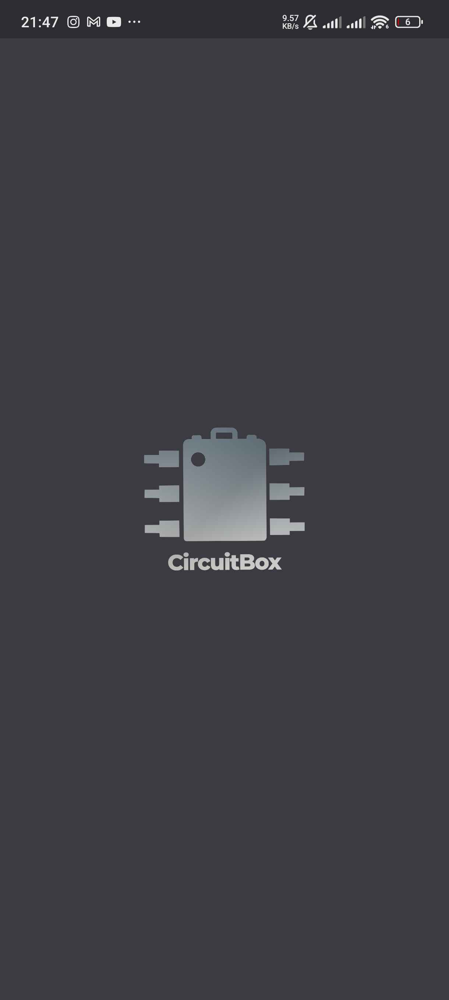
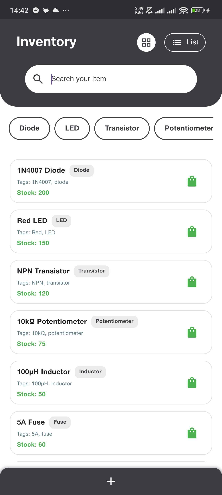
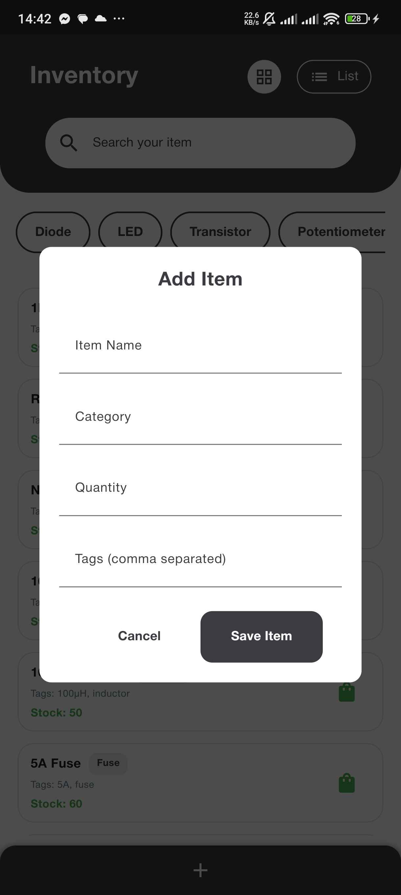
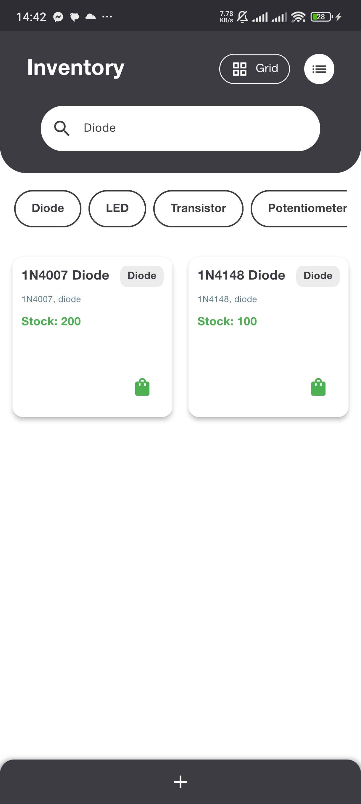
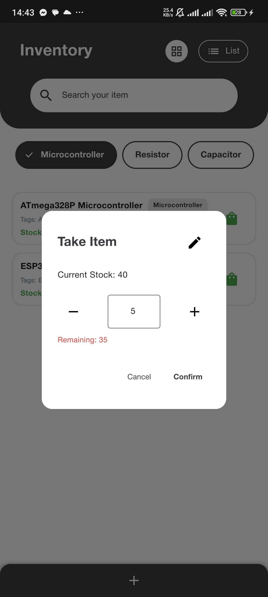
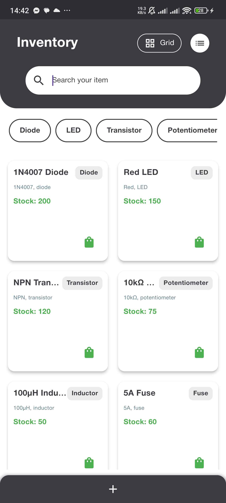

# CircuitBox

CircuitBox is a Flutter app built for electronics enthusiasts who need a reliable way to manage and track their inventory of electrical components. Whether you're a hobbyist or a professional, CircuitBox helps you stay organized.

---

## Features

- **Add Items**: Easily add as many items as you need. Each item has:
  - **Category**: Used for filtering items.
  - **Quantity**: Keeps track of your stock.
  - **Tags**: Useful for searching and grouping items.
- **Search**: Quickly find any item by its name, category, or tags.
- **Take Stock**: Subtract items from your inventory when you use them. Stock updates automatically.
- **Manage Items**: Add, edit, and delete items effortlessly.
- **Intuitive Design**: A simple and user-friendly interface for efficient inventory management.

---

## Screenshots

  
  
  
  
  
  

---

## Figma Concept Designs

  
  

---

## Concept Map

  

---
